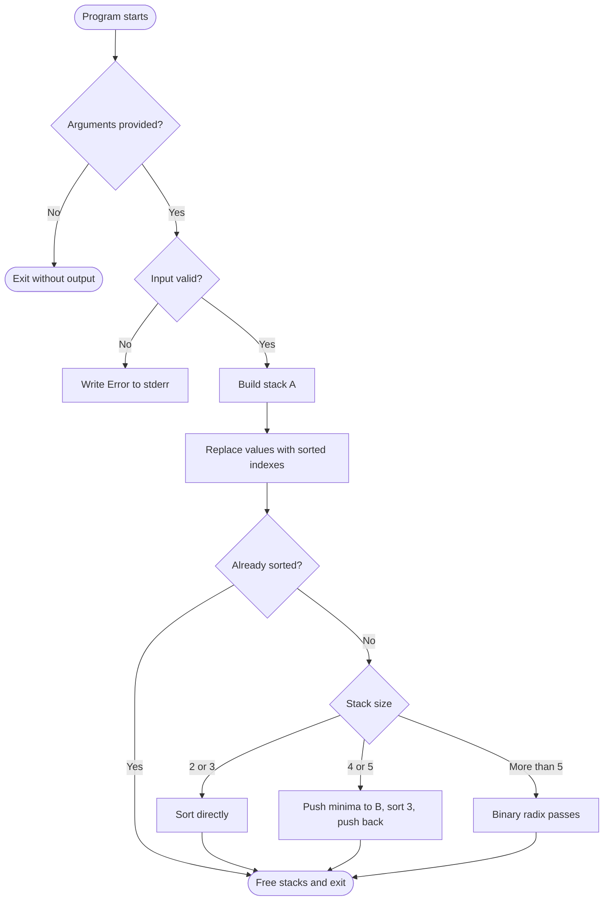
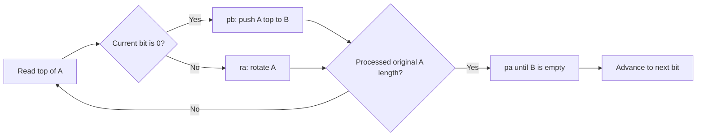

# push_swap

`push_swap` is a 42 School sorting project written in C. The program receives a list of unique integers, builds stack **A**, and prints the shortest practical sequence of stack operations it can use to sort the values in ascending order with the help of an auxiliary stack **B**.

The checker/evaluator can then replay the printed operations to verify that stack **A** is sorted and stack **B** is empty.

## Table of contents

- [Project goal](#project-goal)
- [Allowed operations](#allowed-operations)
- [Algorithm overview](#algorithm-overview)
- [Visual representation](#visual-representation)
- [Repository layout](#repository-layout)
- [Build](#build)
- [Usage](#usage)
- [Input rules](#input-rules)
- [Examples](#examples)
- [Cleaning](#cleaning)

## Project goal

Given integer arguments, output a valid list of push_swap instructions that sorts them:

```text
Initial state:  A contains the input numbers, B is empty
Final state:    A is sorted ascending, B is empty
Output:         One operation per line
```

This implementation first validates the input, stores the values in a linked-list stack, normalizes each value to its sorted rank, and then chooses a sorting strategy based on the input size.

## Allowed operations

| Operation | Meaning |
| --- | --- |
| `sa` | Swap the first two elements of stack A. |
| `sb` | Swap the first two elements of stack B. |
| `pa` | Push the first element of B onto A. |
| `pb` | Push the first element of A onto B. |
| `ra` | Rotate A upward: first element becomes last. |
| `rb` | Rotate B upward: first element becomes last. |
| `rra` | Reverse rotate A: last element becomes first. |
| `rrb` | Reverse rotate B: last element becomes first. |

The project subject also defines combined operations such as `ss`, `rr`, and `rrr`; this codebase implements and prints the single-stack operations listed above.

## Algorithm overview

### 1. Input validation

The program rejects invalid input before sorting:

- empty arguments;
- non-numeric arguments;
- values outside the signed 32-bit integer range;
- duplicate numbers.

On invalid input, it writes `Error` to standard error.

### 2. Stack indexing / normalization

Before sorting, every original value is replaced with its rank in the input set:

```text
Original values:  42  -7  100   0
Indexed values:    2   0    3   1
```

Indexing makes radix sorting simpler because the values become a compact range from `0` to `n - 1` while preserving the same sorted order.

### 3. Small sorts

For short inputs, the program uses hand-written cases:

- 2 or 3 values: sort directly with swaps, rotations, and reverse rotations;
- 4 or 5 values: push the smallest values to stack B, sort the remaining three values in A, then push the saved values back to A.

### 4. Radix sort for larger inputs

For more than 5 values, the program uses a binary least-significant-bit radix strategy over the indexed values:

1. inspect the current bit of each value in stack A;
2. push values with bit `0` to stack B using `pb`;
3. rotate values with bit `1` inside stack A using `ra`;
4. push everything from B back to A using `pa`;
5. move to the next bit and repeat until stack A is sorted.

## Visual representation

The diagrams below show one radix pass over indexed values. Values whose current bit is `0` are pushed from **A** to **B** with `pb`, while values whose current bit is `1` stay in **A** by rotating with `ra`; then **B** is pushed back to **A** with `pa`.

This README intentionally does not embed a binary GIF, because some 42/Git pull-request tools reject binary files. If you want an animated version locally, run the optional generator script; the generated GIF is ignored by Git and does not need to be committed.

```sh
python3 tools/generate_push_swap_gif.py
```

### Running without generated visuals

The visual files are documentation-only. They are not read by `make`, linked into `push_swap`, or required at runtime. You can build and run the sorter with only the C sources and Makefile:

```sh
make
./push_swap 3 2 1
```

### Sorting decision flow



### One radix pass



### Example stack movement

For indexed input `3 0 2 1`, the first radix pass groups values by the least significant bit:

```text
Current bit: 1

Start:              A top -> [3, 0, 2, 1]    B -> []
3 has bit 1: ra     A top -> [0, 2, 1, 3]    B -> []
0 has bit 0: pb     A top -> [2, 1, 3]       B -> [0]
2 has bit 0: pb     A top -> [1, 3]          B -> [2, 0]
1 has bit 1: ra     A top -> [3, 1]          B -> [2, 0]
pa all from B       A top -> [0, 2, 3, 1]    B -> []

Next pass uses the next bit and continues until A is sorted.
```

## Repository layout

| File | Purpose |
| --- | --- |
| `ft_push_swap.c` | Program entry point, stack creation, sort dispatch, and radix loop. |
| `ft_push_swap.h` | Shared structures and function prototypes. |
| `ft_check_input.c` | Argument parsing and validation. |
| `ft_sort_small.c` | Specialized sorting for 2 to 5 values. |
| `ft_sort.c` | Indexing helpers and radix partition helpers. |
| `ft_moves.c` | Primitive stack operations. |
| `ft_do_moves.c` | Operation wrappers that execute moves and print their names. |
| `ft_utils.c` | Small utility helpers. |
| `ft_error.c` | Error handling and memory cleanup. |
| `Makefile` | Build, clean, and rebuild targets. |

## Build

```sh
make
```

This creates the `push_swap` executable.

## Usage

Pass each integer as a separate argument:

```sh
./push_swap 2 1 3 6 5 8
```

The program prints operations only:

```text
sa
pb
ra
pa
```

> The exact sequence depends on the input and the selected sorting path.

## Input rules

Valid input must satisfy all of the following:

- every argument is an integer;
- every value is within `INT_MIN` and `INT_MAX`;
- no duplicate values are present;
- values are passed as separate command-line arguments.

Examples of invalid input:

```sh
./push_swap 1 2 2
./push_swap 1 abc 3
./push_swap 2147483648
```

Each invalid example prints:

```text
Error
```

## Examples

Build and run:

```sh
make
./push_swap 3 2 1
```

Possible output:

```text
ra
sa
```

Count the number of generated operations:

```sh
./push_swap 9 1 8 2 7 3 6 4 5 | wc -l
```

Use with a checker, if one is available:

```sh
ARG="9 1 8 2 7 3 6 4 5"
./push_swap $ARG | ./checker_linux $ARG
```

## Cleaning

```sh
make clean   # remove object files
make fclean  # remove object files and executable
make re      # rebuild from scratch
```
